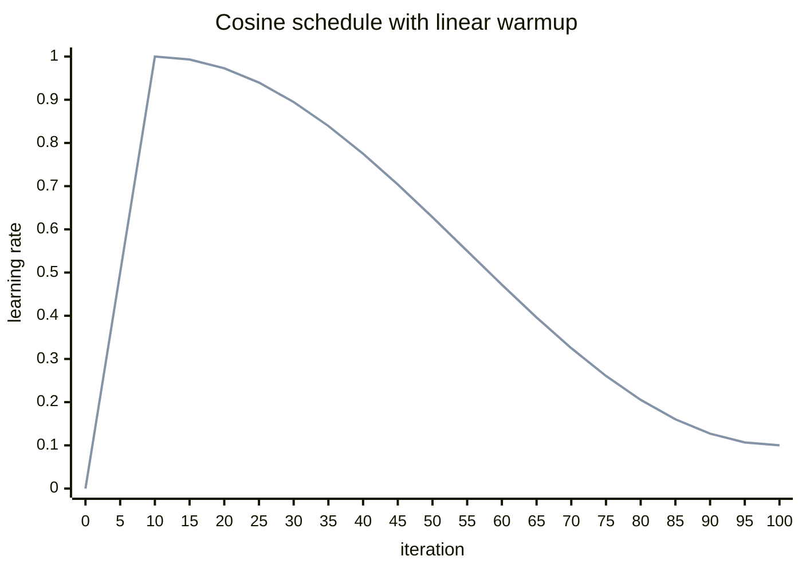

# Cosine Annealing Learning Rate Schedule

Generated using `get_lr_cosine_schedule()` from `cs336_basics/optimizer.py` with:

- `max_learning_rate = 1.0`
- `min_learning_rate = 0.1`
- `warmup_iters = 10`
- `cosine_cycle_iters = 100`

| iteration | learning rate |
| ---: | ---: |
| 0 | 0.000000 |
| 5 | 0.500000 |
| 10 | 1.000000 |
| 15 | 0.993163 |
| 20 | 0.972862 |
| 25 | 0.939711 |
| 30 | 0.894720 |
| 35 | 0.839254 |
| 40 | 0.775000 |
| 45 | 0.703909 |
| 50 | 0.628142 |
| 55 | 0.550000 |
| 60 | 0.471858 |
| 65 | 0.396091 |
| 70 | 0.325000 |
| 75 | 0.260746 |
| 80 | 0.205280 |
| 85 | 0.160289 |
| 90 | 0.127138 |
| 95 | 0.106837 |
| 100 | 0.100000 |

The schedule linearly warms up from `0.0` to `1.0` over the first `10` iterations, then cosine-anneals down to `0.1` by iteration `100`.
